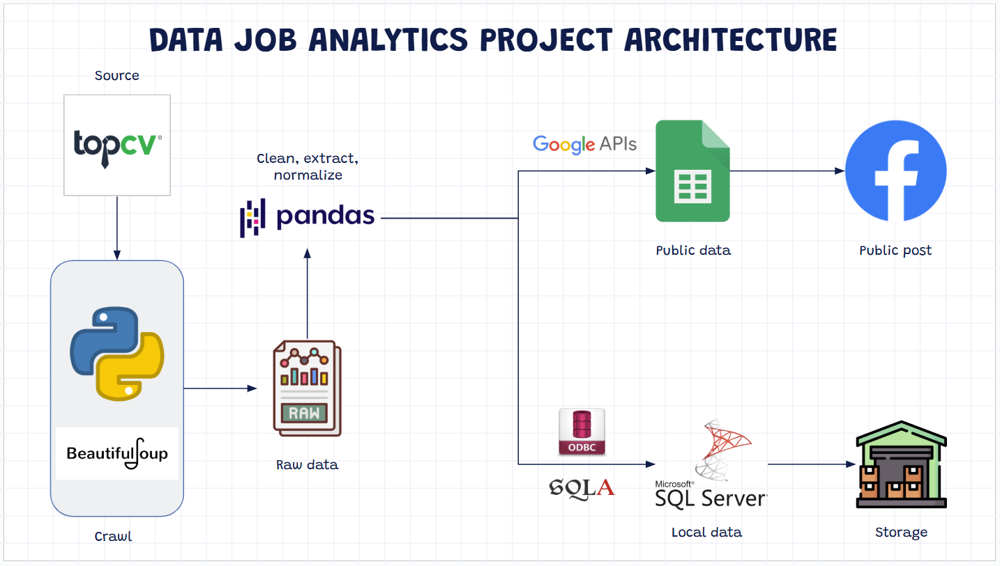
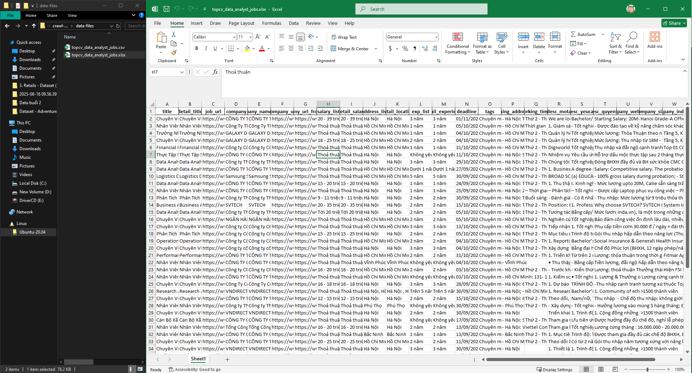
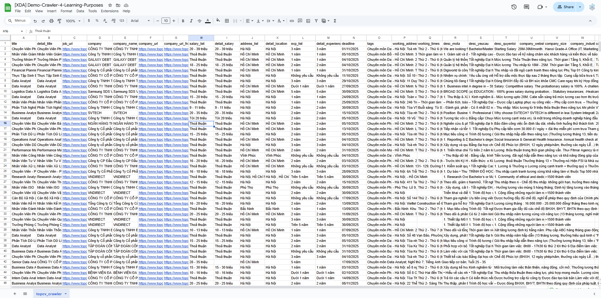
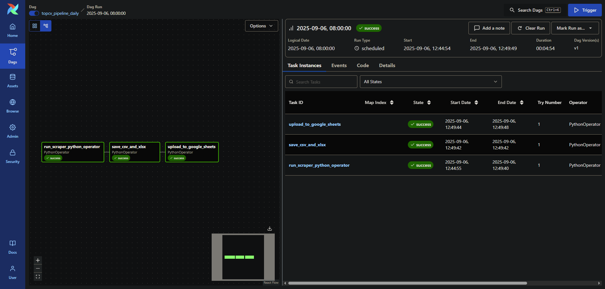

# CRAWL TOPCV JOBS (Learning Purposes)

Crawler nhẹ nhàng để thu thập tin tuyển dụng **Data Analyst** trên TopCV, tự động ghép **chi tiết job** + **thông tin công ty** vào một **Pandas DataFrame**, xuất **CSV/XLSX**, và (mới) **orchestrate bằng Airflow**.

---

## 😎 Kiến trúc pipeline


---

## ✅ Tính năng

* Crawl từ trang search (đa trang).
* Vào từng `job_url` lấy: mức lương, địa điểm, kinh nghiệm, deadline, mô tả/yêu cầu/quyền lợi, tag, địa chỉ & thời gian làm việc.
* Vào `company_url` lấy: tên, website, quy mô, lĩnh vực, địa chỉ, mô tả.
* Chống **429 Too Many Requests** bằng delay ngẫu nhiên.
* Xuất **CSV/XLSX**.
* **Airflow DAG** tự động hóa pipeline:
  * B1: chạy scraper (Python script).
  * B2: lưu CSV/XLSX.
  * B3: đẩy dữ liệu lên Google Sheets.

---

## 🧱 Cấu trúc project

```

.
├── airflow
│   ├── dags/                  # DAGs (run\_scrape\_topcv\_\*.py)
│   ├── docker-compose.yaml    # Compose stack
│   ├── Dockerfile             # Custom Airflow image
│   ├── requirements.txt       # Thư viện cài thêm trong Airflow
│   └── logs/                  # Logs của Airflow
├── scripts/
│   ├── scrape\_topcv\_company.py  # Script crawl chính
│   └── topcv.ipynb              # Notebook thử nghiệm
├── data-files/
│   ├── topcv\_data\_analyst\_jobs.csv
│   ├── topcv\_data\_analyst\_jobs.xlsx
│   └── \~\$topcv\_data\_analyst\_jobs.xlsx
├── credentials/
│   └── google-service-account-sample.json  # Service Account cho Google Sheets: https://cloud.google.com/iam/docs/service-accounts-create
├── imgs/                         # Hình minh họa
│   ├── 00-architect.png
│   ├── 01-excel.png
│   └── 02-airflow\.png
├── pyproject.toml
├── uv.lock
└── README.md

````

---

## 📸 Hình minh họa kết quả

### Kết quả CSV/XLSX


### Kết quả Google Sheets


### Airflow DAG


---

## 🛠️ Yêu cầu

* Python 3.8+  
* [uv](https://github.com/astral-sh/uv) (quản lý môi trường & dependency)  
* (Tuỳ chọn) Google Chrome + ChromeDriver nếu bạn dùng Selenium thay vì `requests`/`BeautifulSoup`.

---

## 🚀 Bắt đầu

### Bước 1 — Khởi tạo dự án với **uv**

```bash
uv init crawl-topcv-jobs
cd crawl-topcv-jobs
````

### Bước 2 — Cài thư viện

> Script chính dùng `requests`, `beautifulsoup4`, `lxml`, `pandas`.
> Bạn có thể cài thêm các lib phục vụ phân tích (matplotlib, seaborn) hoặc Selenium nếu cần.

```bash
# Core crawl + phân tích
uv add requests beautifulsoup4 lxml pandas

# Tuỳ chọn (phân tích/plot, notebook, selenium)
uv add matplotlib seaborn ipykernel selenium webdriver-manager
```

### (Tuỳ chọn) Đẩy code lên GitHub

```bash
gh auth login
gh repo create crawl-topcv-jobs --private --source=. --remote=origin --push
```

### Bước 3 — (Tuỳ chọn) Cài Chrome cho Selenium

> Không bắt buộc nếu bạn chỉ dùng `requests` + `BeautifulSoup`.

```bash
wget https://dl.google.com/linux/direct/google-chrome-stable_current_amd64.deb
sudo apt install ./google-chrome-stable_current_amd64.deb
```

---

## ▶️ Chạy crawler

Script mặc định crawl trang:

```
https://www.topcv.vn/tim-viec-lam-data-analyst?type_keyword=1&page={page}&sba=1
```

Chạy:

```bash
cd scripts
uv run scrape_topcv_company.py
```

Kết quả:

* In ra `head()` của DataFrame
* Lưu `topcv_data_analyst_jobs.csv` (UTF-8-SIG) trong thư mục `data-files/`

> Muốn đổi số trang, sửa nhanh trong `__main__`:

```python
qtpl = "https://www.topcv.vn/tim-viec-lam-data-analyst?type_keyword=1&page={page}&sba=1"
df = crawl_to_dataframe(qtpl, start_page=1, end_page=10, delay_between_pages=(0.5, 1.0))
```

---

## ⚙️ Điều chỉnh tốc độ (để tránh 429)

Script có hai “điểm nghỉ”:

* `smart_sleep(0.5, 1.0)` → nghỉ ngẫu nhiên **0.5–1.0s** giữa các request (job/company).
* `delay_between_pages=(0.5, 1.0)` → nghỉ **0.5–1.0s** giữa các **trang search**.

> Nếu vẫn bị 429:

* Tăng delay (ví dụ `smart_sleep(1, 2)`, `delay_between_pages=(2, 3)`).
* Thu hẹp số trang; chạy ngoài giờ cao điểm; dùng IP/proxy hợp lệ.
* Tái sử dụng `requests.Session()` (đã làm sẵn) để giữ cookie.
* Tôn trọng robots & điều khoản website.

---

## 🧪 Mẫu sử dụng DataFrame

Mở rộng trong notebook hoặc script khác:

```python
import pandas as pd

df = pd.read_csv("topcv_data_analyst_jobs.csv")
print(df.shape)
print(df.columns)

# Lọc job ở TP.HCM, có “Python” trong mô tả yêu cầu
mask_hcm = df["detail_location"].fillna("").str.contains("Hồ Chí Minh", case=False)
mask_py  = df["desc_yeucau"].fillna("").str.contains("Python", case=False)
df_filtered = df[mask_hcm & mask_py]
df_filtered.head()
```

Xuất XLSX:

```python
df.to_excel("topcv_data_analyst_jobs.xlsx", index=False)
```

---

## 🚀 Orchestration với Airflow

Repo đi kèm stack Airflow (Docker Compose).

Chạy:

```bash
cd airflow
docker compose up -d
```

Airflow sẽ khởi động (web UI [http://localhost:8080](http://localhost:8080)).
Trong UI, bật DAG **`topcv_pipeline_daily_v2`** hoặc **v3** để pipeline tự động:

* `run_scraper_with_uv` → chạy script crawl.
* `save_csv_and_xlsx` → đảm bảo CSV, chuyển sang XLSX.
* `upload_to_google_sheets` → đẩy dữ liệu lên Google Sheets (qua Service Account).

---

## 🗺️ Hướng mở rộng

* Chuẩn hóa dữ liệu (địa điểm, lương).
* Crawl thêm từ khóa khác (Data Engineer, BI, ML…).
* Lưu DB (Postgres) thay vì file.
* Dashboard bằng Power BI/Metabase.
* Tự động phân tích thị trường tuyển dụng từ dữ liệu đã crawl.

---

## 📄 License

MIT — dùng cho mục đích học tập & nghiên cứu.
⚠️ Tôn trọng điều khoản sử dụng của TopCV, không gây tải nặng.

```

---